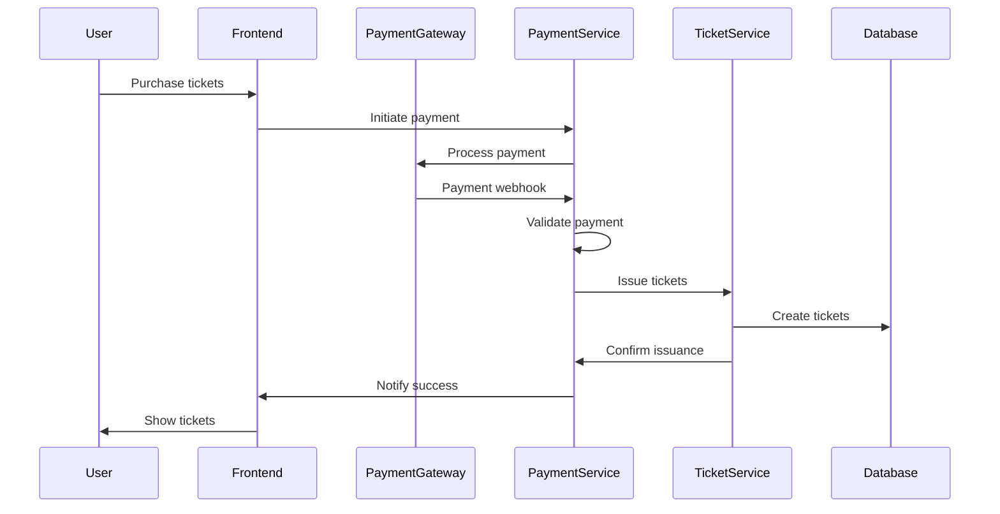

# Payment Integration Requirements

## Overview
This document outlines the integration requirements between the TicketService and PaymentService modules for secure ticket issuance after payment confirmation.

## Current Implementation Status
- ✅ **TicketService**: Fully implemented with placeholder payment validation
- ⚠️ **PaymentService**: Skeleton implementation with mock responses
- ⚠️ **Payment Webhook**: Not yet implemented

## Payment Validation Requirements

### 1. Payment Status Validation
The payment must be validated before issuing tickets. The following conditions must be met:

- Payment exists in the system
- Payment status is `CONFIRMED` or `COMPLETED`
- Payment amount matches the ticket tier price × quantity
- Payment has not already been used for ticket issuance
- Payment is not expired or cancelled

### 2. Webhook Integration Flow



### 3. Required PaymentService Endpoints

#### GET /api/payments/{paymentId}/status
- Returns payment status and details
- Used by TicketService to validate payment before issuance

#### POST /api/payments/{paymentId}/mark-used
- Marks payment as used for ticket issuance
- Prevents duplicate ticket creation

#### POST /api/payments/webhook
- Receives webhook from payment gateway (Payaza/Flutterwave)
- Validates payment and triggers ticket issuance

## Current Placeholder Implementation

The `ValidatePaymentForTicketIssuanceAsync` method in `TicketRepository` currently returns `true` for any non-empty GUID. This should be replaced with actual PaymentService integration:

```csharp
public async Task<bool> ValidatePaymentForTicketIssuanceAsync(Guid paymentId)
{
    // TODO: Replace with actual PaymentService integration
    // Current implementation is a placeholder
    
    // Real implementation should:
    // 1. Call PaymentService to get payment details
    // 2. Verify payment status is CONFIRMED/COMPLETED
    // 3. Ensure payment hasn't been used for ticket issuance
    // 4. Validate payment amount matches ticket requirements
    
    return paymentId != Guid.Empty;
}
```

## Integration Implementation Steps

### Phase 1: PaymentService Enhancement
1. Implement real payment models and database schema
2. Create payment status tracking and validation logic
3. Add payment gateway integration (Payaza/Flutterwave)
4. Implement payment webhook handling

### Phase 2: Cross-Service Integration
1. Create PaymentService client in TicketService
2. Replace placeholder validation with real PaymentService calls
3. Implement proper error handling for payment failures
4. Add retry logic for payment service calls

### Phase 3: Webhook Integration
1. Configure payment gateway webhooks to call PaymentService
2. Implement automatic ticket issuance on payment confirmation
3. Add webhook security validation (signatures, IP allowlists)
4. Implement idempotency to prevent duplicate ticket issuance

## Security Considerations

### Payment Webhook Security
- Validate webhook signatures from payment gateway
- Implement IP allowlisting for webhook endpoints
- Use HTTPS for all payment-related communications
- Log all payment validation attempts for audit

### Ticket Issuance Security
- Ensure payment validation before ticket creation
- Implement idempotency keys to prevent duplicate tickets
- Add rate limiting for ticket issuance endpoints
- Validate user permissions for ticket creation

## Error Handling

### Payment Validation Failures
- Log payment validation failures with details
- Return appropriate error messages to users
- Implement retry logic for transient failures
- Send notifications for failed payment attempts

### Ticket Issuance Failures
- Rollback partial ticket creation on failure
- Update payment status to reflect issuance failure
- Notify user and payment gateway of failures
- Implement manual reconciliation processes

## Testing Strategy

### Unit Tests
- Mock PaymentService responses for TicketService tests
- Test all payment validation scenarios
- Verify error handling for payment failures

### Integration Tests
- Test end-to-end payment to ticket flow
- Validate webhook processing
- Test payment gateway integration

### Load Tests
- Test concurrent payment processing
- Validate system behavior under high ticket demand
- Test webhook handling capacity

## Monitoring and Observability

### Metrics to Track
- Payment validation success/failure rates
- Ticket issuance latency
- Webhook processing times
- Failed payment attempts

### Alerts
- Payment validation failures
- Ticket issuance failures
- Webhook processing delays
- Unusual payment patterns

## Future Enhancements

### Advanced Features
- Partial payment support for installment tickets
- Payment refund handling for cancelled tickets
- Multi-currency support
- Payment method preferences per user

### Scalability
- Implement async ticket issuance for high-volume events
- Add payment processing queues
- Implement distributed payment validation caching
- Add payment service load balancing

## Compliance Requirements

### PCI DSS
- Never store sensitive payment data in TicketService
- Use payment tokens for payment references
- Implement secure payment data transmission

### Data Protection
- Encrypt payment references at rest
- Implement data retention policies for payment logs
- Add GDPR compliance for payment-related data

## Conclusion

The ticket issuance system is designed with security and reliability in mind. The current placeholder implementation allows for development and testing while the PaymentService is being built. Once the PaymentService is complete, the integration can be implemented following the guidelines in this document.
